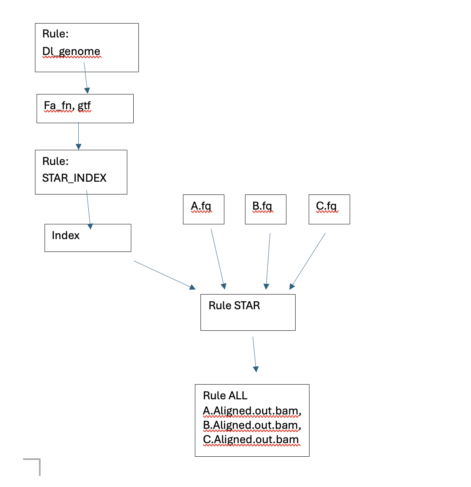
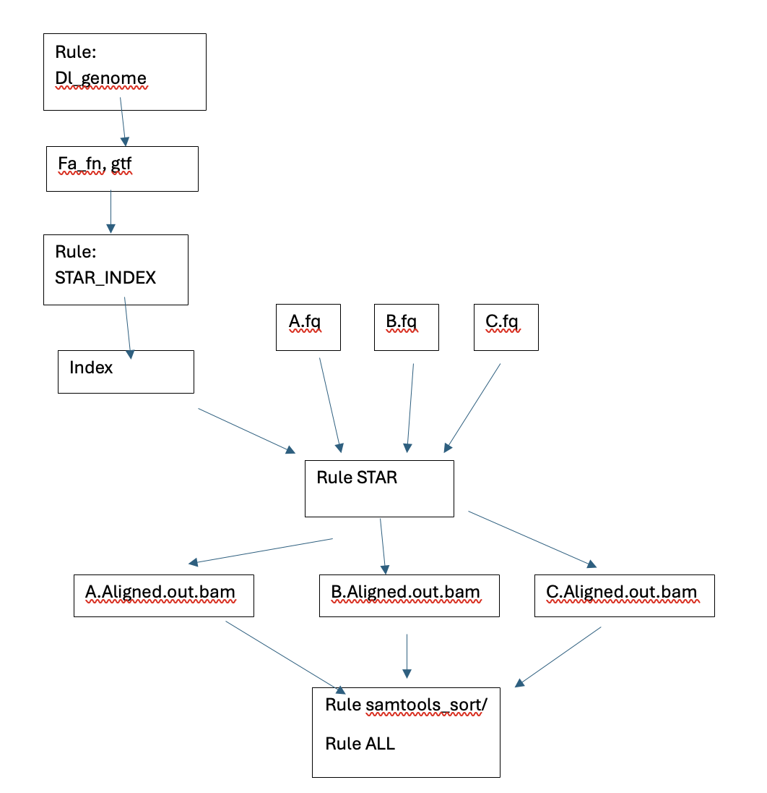
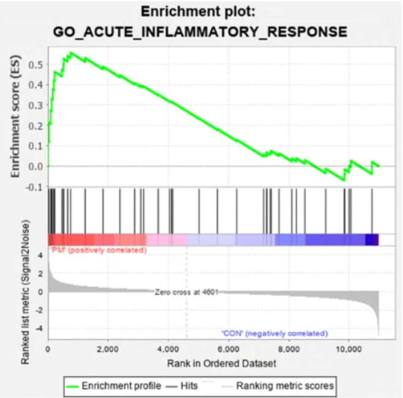

# Project 1 - Discussion Questions
Since we’ve used the first project as practice, these questions are meant to
help me assess how well I’ve conveyed some of the material as well as challenge
you to think conceptually about some of the underlying science. All of these
questions can be answered in a few sentences so do your best to be concise.

Remember, I will evaluate and give you feedback on your answers and allow you to
resubmit. As long as you address all of the comments in your resubmission, you
will receive full credit for this first project.

Open a Rstudio session to work on these questions. You may display any included
images by clicking on the `run current chunk` option for any r blocks that have
an `include_graphics` command in knitr. 

## Snakemake

Consider the following sample snakemake workflow and assume the files A.fq,
B.fq, and C.fq exist in the current working directory. (N.B. Some of these
commands in shell may not technically run, but the logic of the snakefile is
correct)

```
fa_fn = ‘ncbi_dataset/data/GCF_000001635.27/chr19.fa'
gtf_fn= ‘ncbi_dataset/data/GCF_000001635.27/genomic.gtf'
star_index = ‘Chr19_STAR_index’
FILES = [‘A’, ‘B’, ‘C’]

rule all:
	input:
		expand(‘{sample}.Aligned.out.bam’, sample=FILES)

rule dl_genome:
	output:
		fa = fa_fn,
		gtf = gtf_fn
	shell:
		‘’’
		datasets download genome accession GCF_000001635.27 
    –include gtf, genome
    –chromosomes 19
    
		unzip ncbi_dataset.zip
		‘’’

rule STAR_index:
	input:
		fa = fa_fn,
		gtf = gtf_fn,
	output:
		index=directory(star_index)
	threads: 4
	shell:
		‘’’
		STAR –runMode genome generate \
		–genomeDir {output.index} \
		–genomeFastaFiles {input.fa} \
		–sjdbGTFfile {input.gtf}
		‘’’
		
rule star:
	input:
		fq=’{sample}.fq’,
		index=’Chr19_STAR_index’
	output:
		‘{sample}.Aligned.out.bam’
	params:
		prefix = ‘{sample}.’
	shell:
		‘’’
		STAR –genomeDir {input.index} \
    –readFilesIn {input.fq} \
    –outSAMtype BAM Unsorted \
    –outFileNamePrefix {params.prefix}
    ‘’’
```

1. We’ve talked in class about how you can represent snakemake workflows visually.
Technically speaking, snakemake creates a directed acyclic graph that represents
the workflow. Draw the DAG for this sample snakemake workflow. Boxes indicate
the rules, and arrows indicate dependencies. Make this diagram in whatever
software you'd like and save it to this repo. Fill in the following code with the
name of the file you created and it will display it here in this markdown.

```{r}

```


2. Write a valid snakemake rule that would run samtools sort on the outputs from
rule star. Name the outputs of this rule with the extension _sorted.bam.
```
rule samtools_sort: 
    input: 
        bam           = ‘{sample}.Aligned.out.bam’
    
    output:
        sorted_bam    = '{sample}_sorted.bam'
    
    threads: 2
    
    shell:
        '''
        samtools sort {input.bam} -o {output.sorted_bam} -@ {threads}
        '''
```


3. Assume that we change our rule all input to be the following:
	
		expand(‘{samples}_sorted.bam’, samples=FILES)	

Re-draw the DAG assuming your rule from part 2 works as expected. Display it 
here using the following code:

```{r}

```


## RNAseq

1. List the major high-level steps of a basic RNAseq experiment to look for
differentially expressed genes. At each step, list what data you need to perform
each step and what format they are in (if applicable). At minimum, there are 4
essential steps.

**Step 1: Library preparation**: The first step of RNA-Seq is to prepare and isolate RNA from samples. RNA is isolated, fragmented, and then reverse amplified into cDNA. There are certain properties of the library preparation process that may influence downstream analyses, such as the ribosomal depletion method, performing single vs paired end sequencing, read fragment size, and stranded vs unstranded. A number of tags such as adapter and barcodes are added to the amplified cDNA to prepare for sequencing runs as well. Optional Quality Control steps exist at multiple points throughout this step.

**Step 2: Sequencing** The prepared sequences are read (typically paired end) and the collection of reads is trimmed, demultiplexed and sorted to original sample files, R1 and R2 if paired end. 

**Step 3: Read QC, Assembly and Mapping** Although there are a number of downstream analyses possible with RNA-Seq reads, the first steps will likely be the same. 
QC tools such as trimmomatic can first be used on the raw read files, aka fastq files, to filter out reads that are low quality, or still containing some of the tags from sequencing. 
Next, we can use a read mapper like STAR to map reads to a reference genome. 
Typically programs also generate an index for the reference genome to speed up computational searches for the reference genome. 
In our case STAR is able to both generate an index for the reference genome and map reads to it. 
STAR produces an sequence alignment (SAM) file which contains information about where all the reads map to. 
QC/QA can also be performed at this step with tools such as Samtools, which has many options for working with the SAM files. 
For differential expression, we will use programs like VERSE or Salmon that will quantify the abundance of reads that map to gene regions. 
By giving these tools an annotation file that contains information about regions of interest in the refernece genome, the tools is able to see which reads map to specific regions of interest. 
These tools typically produce delimited files that then show gene names in one column, and some metric of abundance in another for each sample.


**Step 4: Counts Analysis** Programs like verse will count how many reads align to gene regions of the annotated reference genome for each sample. To perform differential expression analyses such as DESeq2, we will have to combine all of the counts data we have generated for each sample into one file, a counts matrix. As a part of this process, we can also filter out genes that are not of interest. This could include filtering out low variance genes, or genes with little to no counts. Once we have a combined counts matrix, we can run DE analyses like DESeq2.


2. Consider the following FastQC plot.

```{r}
knitr::include_graphics("fastqc_plot.png")
```


2a. What aspect of the data does this plot show?

This is a distribution of GC content in raw reads for the sample The blue line is the 'ideal' or theoretical distribution, and the purple curve is the observed. 


2b. Make an interpretation of this plot assuming the data type was RNASeq.

The reads in this sample have a large portion of reads with abnormally high GC content (the 75-90% range). High GC content is characteristic of RNA - Seq. 
The distribution of the majority of reads however is narrower (on the lower end at least) than the theoretical distribution.
In other words, very small portion of reads have very low GC content.


2c. Do you think this plot indicates there was a problem with the dataset?
Explain your answer.

Even though FastQC reports that there is an issue and the observed distribution does not match the theoretical distribution, I do not believe there is a problem. A number of reasons can cause high GC content, especially in RNASeq data. Low sequence quality towards the tail ends of reads can contribute to this issue. 


3. What is a splice-aware aligner? When is it important to use a splice-aware
aligner?

Splice-aware aligners take into account that the individual reads we have from RNA-Seq may span large chunks of the genome due to splicing of exons and introns. I.e., a read may span the junction of two exons and as a result it may map to two different regions on the genome.


4. What does a “gene-level” count as produced by VERSE or any other counting
tool in a RNAseq experiment represent?

The counts represents how many reads map to gene regions of the genome, and is thought to be loosely proportional to gene expression levels. 
It is not a direct measurement of the number of each gene's mRNA transcripts in a sample.


5. In your own words, briefly describe what information the matching GTF for a
reference genome stores.

The GTF is an annotation file that stores information about the reference genome. This includes regions and what they represent, such as exons, introns, genes, structural regions, regulatory regions, etc.. 
For differential expression, the features of interest are the location (where in the genome, basepair range), the feature type (exon for us), the gene name/ID it the feature type belongs to. 


6. When counting alignments using VERSE or any other utility, why do we need to
provide the matching reference genome GTF file?

The GTF file allows Verse to count how many reads belong to specific regions of the genome, which in our case are gene and exonic regions. 
More specifically, the GTF allows VERSE to know what regions and the significance of the regions that reads are mapping to in the genome. 
It does this by inspecting the location of where a read is mapping, and seeing if falls in a region of intersest that you have specified when calling VERSE.
VERSE specifically needs from a GTF file: location of region of interest (the basepair range), type of region of interst (gene, exon, etc.), gene name/ID.


7. Let’s pretend that this was a GSEA result from an experiment where we treated
293T cells with a drug and compared changes in gene expression to wild-type
cells treated with a vehicle control. The differential expression results are
relative to the control cells (i.e. a positive fold change means a gene is
upregulated upon treatment with the drug)

Assume the following result is statistically significant with a positive NES
(normalized enrichment score) and that it represents a GSEA experiment performed
on the entire list of genes discovered in the experiment ranked by
log2FoldChange (i.e. genes that are “upregulated” in the cells treated with drug
are on the “left” and genes that are “downregulated” due to treatment are on the
“right”).

```{r}

```


7a. Form a valid interpretation / conclusion of the results shown in the plot
given the above setup.

A large chunk of genes part of the acute inflammatory response are found at the left end of the log fold change ranking. This means many of the genes that are found in this gene set have high log fold changes. 
The middle portion of the graph that looks like a barcode shows where genes that are in the gene set of interest lie in the ranked list, which is typically ranked by a metric like log2FoldChange. 
Black bars are the genes. The graph with the green line in the top half of the graph shows the trend of how many genes in the geneset are found as you progress down the ranked list. When a gene in the gene set is found, the enrichment score increases, and slowly decreases when sifting through the genes that are not a part of the gene set.
We see a very strong enrichment towards the left end of the ranked list (the largest or smallest values in whatever metric is being used to rank the gene list). This suggests that in this differential expression experiment, the difference between control/experimental group leads to a very high enrichment of many of the genes in this geneset, aka a high enrichment score.
The broader interpretation of this figure: there is a high number of genes in the 'acute inflammatory response' gene set that is being strongly enriched/upregulated in this experiment. 


7b. Now consider that all of the genes driving the enrichment are all activators
of the inflammatory pathway. Does your interpretation change and if so, how?

The interpretation does not change, but we are able to say that the genes that are highly differentially expressed are likely activators of the inflammatory pathway.


7c. Finally, consider that all of the genes driving the enrichment all function
to inhibit inflammation. Does your interpretation change and if so, how?

This would essentially be the opposite interpretation of the previous question. The drug would be inhibiting the inflammatory response. 


## O’Meara et al. Transcriptional Reversion of Cardiac Myocyte Fate During
## Mammalian Cardiac Regeneration. Circ Res. Feb 2015. PMID: 25477501


1. Write out a methods section describing what steps of the analysis you performed
and which tools you used. Style this section as you would find a methods section
in a scientific publication. Remember to include the important details that
would allow a third party to reproduce your exact analysis. You can safely
exclude details that do not affect the underlying results.

Following RNA extraction, double stranded synthesis, and amplification, DNA samples were sequenced using Illumina HighSeq 2000. 
The data can be accessed via GEO accession number GSE64403.
Raw paired end reads were demultiplexed and inspected using quality control software FastQC (v0.12.1).
The generated QC reports were concatenated into one using MultiQC (v1.17). 
STAR (v2.7.11b) index was used to create an index from the m39 reference mouse genome assembly with flags '--sjdbOverhang 99 --genomeSAindexNbases 11', and STAR align aligned raw reads to the index to generate unsorted BAMs. 
Samtools (v1.19.2) flagstat was used to inspect the quality of alignments. 
To generate count data for each gene in each sample, Verse (v0.1.5) was used with flags '-t exon -g gene_id'. 
Using custom python scripts, all count files were first concatenated into a large matrix with Pandas (v2.2.0) in the custom script `concat_df.py`. 
Additionally, a mapping file was generated to convert Gene ID's into gene names using the script `parse_gtf.py`. Lastly, the script `filter_cts_mat.py` is used to filter the concatenated counts matrix to remove genes that had no counts across all samples. 
To perform differential expression analyses across the P0 and Adult time points, the R (v4.2.1) BioConductor package DESeq2 (v1.42.0). 
DESeq2 first normalizes the raw counts matrix and then computes a number of Differential Expression statistics (padj, log2FoldChange, etc.) for each gene across the two given timepoints. 
Additionally, the Bioconductor package fGSEA (v1.28.0) was used to perform gene set enrichment analysis on the C2 gene sets. 
fGSEA reports pathways and their positive or negative enrichment across all four time points. 

Code and scripts to generate results can be found online on the github page 'https://github.com/BF528/project-1-template-John2018330/tree/main' (currently set to private). 


2. Why did the authors perform RNA-seq on these specific samples? What was their
goal in doing so?

The authors wanted to see how the transcriptional phenotype of neonatal mice's hearts changes as it develops. The cardiac tissue found in neonatal mice has the ability to regenerate in response to injury, but is lost after a week of development. The authors want to gain insight into the molecular mechanisms responsible for this ability. More specifically, the authors wanted to see if after injury, the cardiac myocytes revert to a less differentiated state in the context of transcription and identify regulators of this process.


3. Using either your GSEA results OR your replication of Figure 1D, draw a conclusion
about the main result this RNA-seq experiment shows. Do your results generally
agree with those of the original publication?

Using the GSEA results and Figure 1D, we definitely see an upregulation of gene sets related to the mitochondria (ATP synthesis). For the genes related to sarcomere functioning, we only see a high spike in upregulation once the mice reach the adult stage of development. Cell cycle genes are relatively constant or down regulated throughout P0 to Adult stage, maybe signifying a slowing growth rate as the mouse matures. Overall the results described capture a transcriptional profile for the development of mice from birth to Adult stage. The results produced in our analyses do closely match the results from the paper.


4. List at least two reasons why your results may be **slightly** different than
those found in the original publication.

Firstly, once we generated the raw counts matrix, the criteria and thresholds we used to filter out genes is likely different. We filtered out genes with no counts across all samples, but there are many other metrics for doing so as well, such as filter out low variance genes (genes that are expressed at the same rate across all samples).

Secondly, this software we used to perform these analyses may be slightly different as well. These analyses involve the use of many tools, of which there are many alternatives and many versions for each as well. The different approaches can lead to slightly different results.


